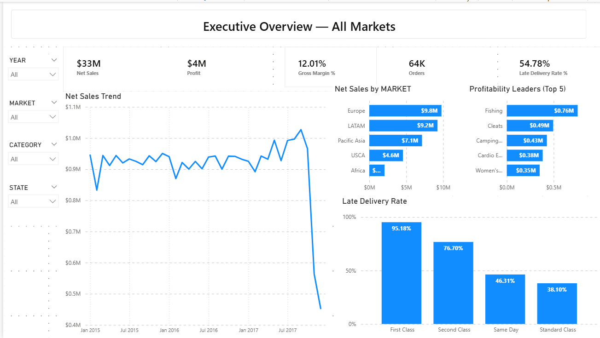
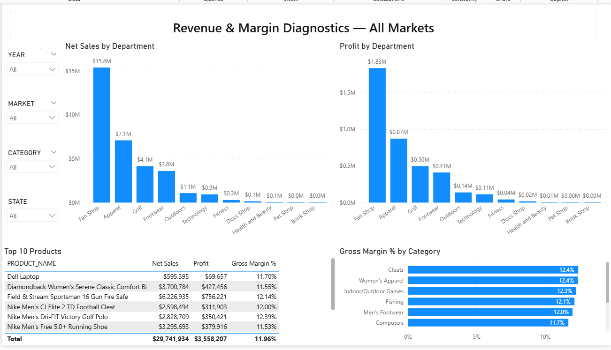
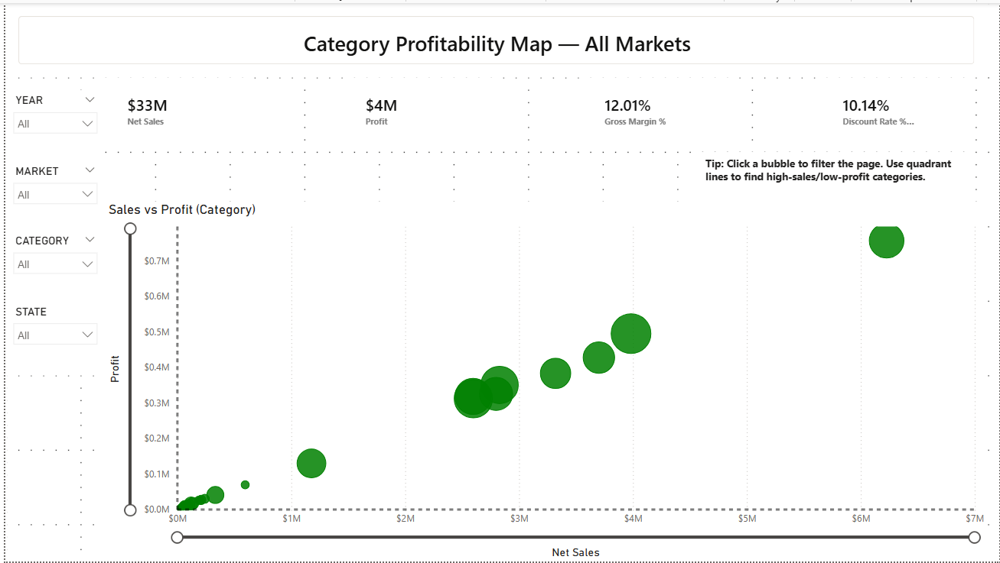
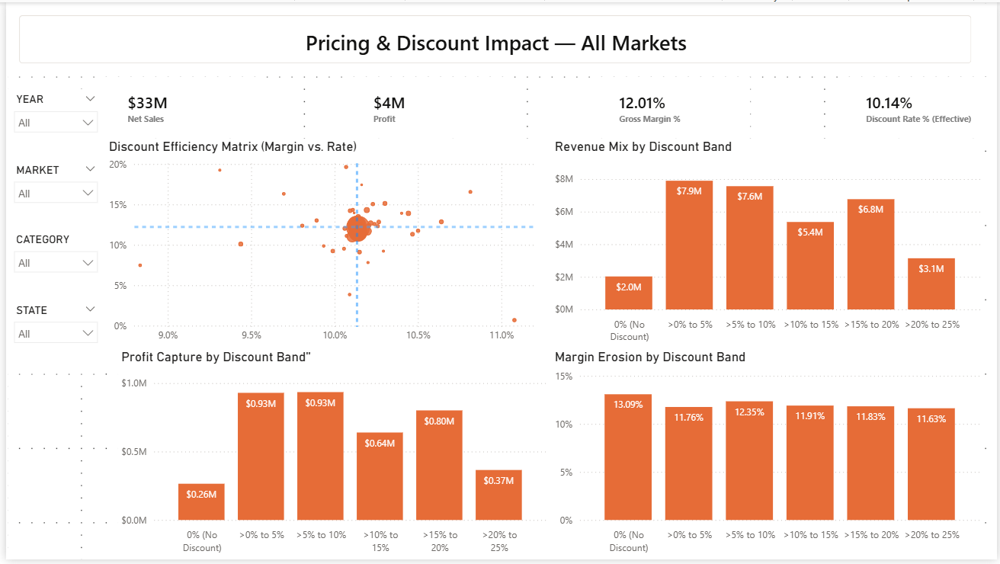
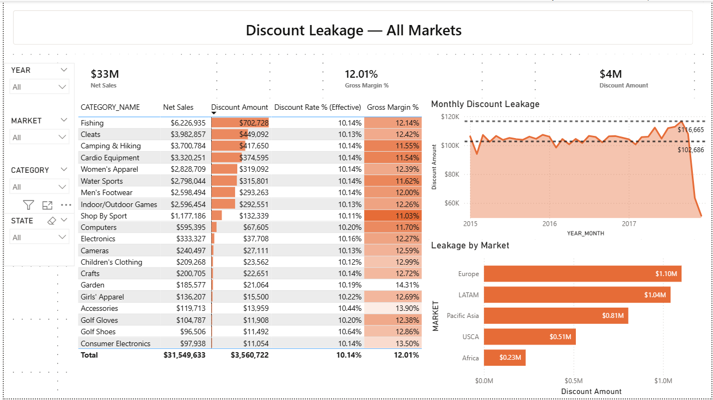
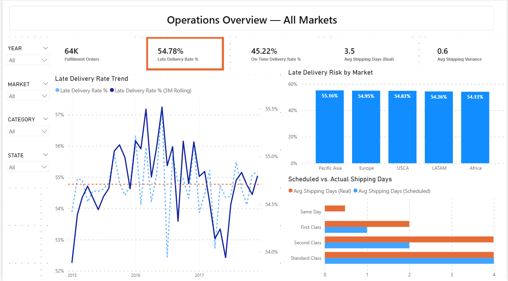
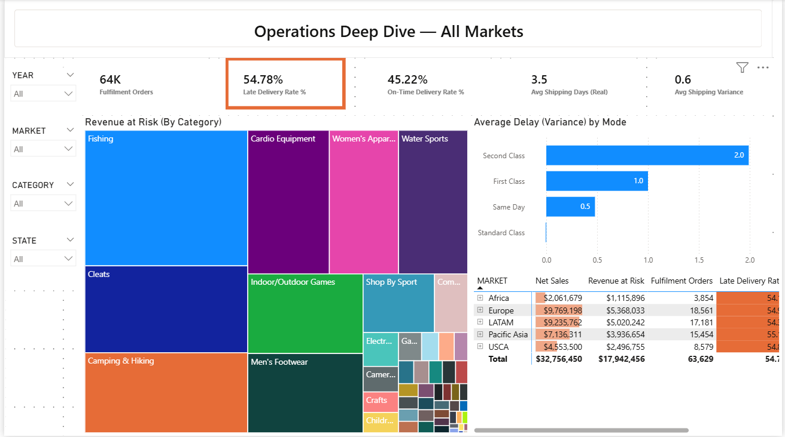
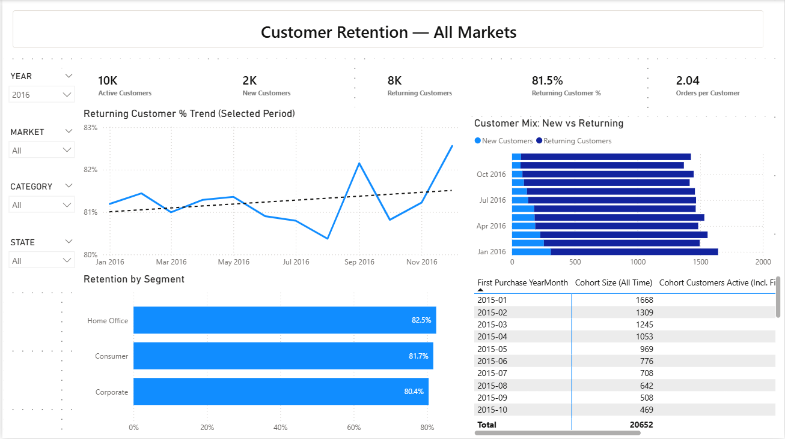
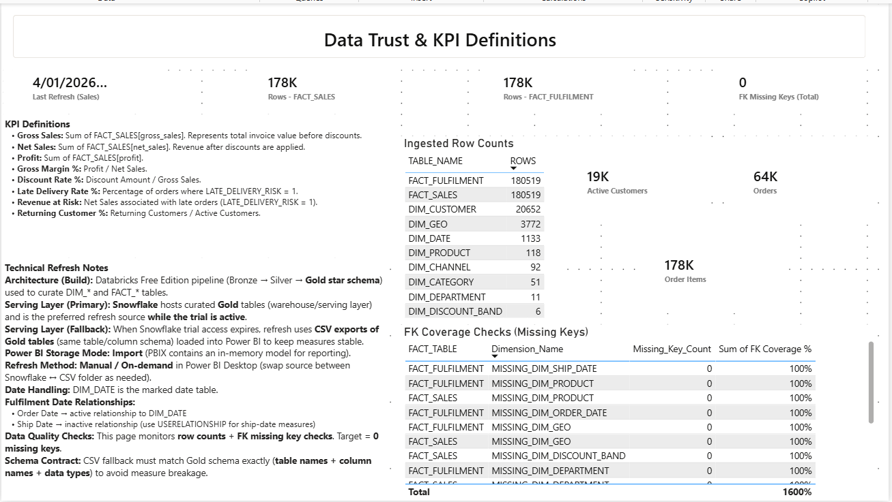

# Commercial + Fulfilment Executive Dashboard (v1)

## Databricks → Snowflake (trial serving layer) → Power BI
with CSV fallback for durability after trial expiry.

End-to-end analytics build that takes raw retail + fulfilment data through a **medallion pipeline (Bronze → Silver → Gold)** in **Databricks Free Edition**, models it as a **star schema**, and delivers a **Power BI executive dashboard** covering commercial performance, discount leakage, fulfilment risk, and customer retention.

> **Important:** Snowflake was used as the primary “serving layer” during the trial window.  
> To keep this project durable after the trial ends, the report supports a **CSV fallback serving layer** (Gold exports loaded into Power BI).

---

## What this delivers

**Business outcomes**

- Executive overview of **Net Sales, Profit, Gross Margin %, Orders**
- Pricing & discount analysis + **Discount Leakage Table**
- Operations & fulfilment monitoring (late delivery trend, risk by market, scheduled vs actual shipping days)
- Customer retention view (new vs returning, retention trend, cohort table)
- Data trust page (row counts, FK coverage checks, KPI definitions **Core KPIs:** Net Sales, Profit, Gross Margin %, Orders, Discount $, Discount Rate, Late Delivery %, Avg Shipping Delay Days, Returning Customer Rate + refresh notes)

**Engineering signals**

- Databricks medallion pipeline with curated **Gold star-schema tables**
- Dimensional modelling (facts + conformed dimensions + date role handling for ship date)
- Data quality checks (row counts + FK missing key checks)
- GitHub-ready documentation pack (BI brief, KPI glossary, data dictionary notes, QA reports)

---

## Architecture 

1. **Databricks Free Edition**

- Bronze: ingestion + raw audit
- Silver: cleaned/standardised entities
- Gold: curated fact/dim tables + star schema + quality checks

2. **Serving layer**

- **Primary (during trial):** Snowflake Gold tables (semantic serving layer)
- **Fallback (durable):** CSV exports of Gold tables loaded into Power BI

3. **Power BI Desktop**

- Imports Gold tables (Snowflake or CSV fallback)
- Measures & KPI logic (commercial, fulfilment, retention)
- Executive dashboard pages + QA/definitions page

---

## Power BI report

**Report:** Commercial + Fulfilment Executive Dashboard (v1)  
**Power BI assets:** see **`/powerbi/`** (includes PBIX + screenshots + a Power BI-specific README)

### Pages included (v1)

### Report pages (highlights)

**01) Executive Overview** — top-line KPIs + trends + market/category views  


**02) Commercial Breakdown** — product/category/department performance  


**03) Profitability Scatter** — net sales vs profit (quadrant analysis)  


**04) Pricing & Discount Impact** — discount rate/amount vs margin/profit outcomes  


**05) Discount Leakage Table** — categories giving away the most discount $  


**06) Operations Overview** — late delivery trend, risk by market, scheduled vs actual days  


**07) Operations Deep Dive** — revenue at risk + delay drivers + market table  


**08) Customer Retention** — new vs returning + retention trend + cohorts  


**09) Data Trust & KPI Definitions** — row counts, FK checks, KPI definitions, refresh notes  



---

## Repo structure (recommended)

```text
/powerbi/
  Commercial_Fulfilment_Executive_Dashboard_v1.pbix
  README.md
  /screenshots/
    01.png
    02.png
    ...
/data/
  /databricks_gold_export/
    FACT_SALES.csv
    FACT_FULFILMENT.csv
    DIM_DATE.csv
    DIM_CUSTOMER.csv
    DIM_PRODUCT.csv
    DIM_CATEGORY.csv
    DIM_DEPARTMENT.csv
    DIM_GEO.csv
    DIM_CHANNEL.csv
    DIM_DISCOUNT_BAND.csv
/docs/
  01_bi_brief.md
  02_kpi_glossary.md
  03_data_dictionary_notes.md
  04_ingestion_log.md
  05_silver_layer_story.md
  06_data_quality_report.md
  07_engineering_notes_errors_and_decisions.md
  08_star_schema.md
  09_gold_data_quality_report.md
```

## Quick start (CSV fallback – durable)

1. **Open the PBIX**

- `powerbi/Commercial_Fulfilment_Executive_Dashboard_v1.pbix`

2. **Point Power BI to the CSV export folder**

- Repo-relative folder: `data/databricks_gold_export`

3. **Refresh the model**

- Power BI Desktop → **Home → Refresh**
- If prompted for a folder/parameter, select your local path:
  - `<your-local-repo-path>/data/databricks_gold_export`

✅ The report should load using the Gold CSV exports.

---

## Notes on Snowflake vs CSV fallback

- **Snowflake (primary):** used as the serving layer while the trial is active.
- **CSV fallback (durable):** keeps the dashboard refreshable after Snowflake access expires.
- **Schema contract matters:** CSV filenames + column names + data types must match the Gold schema so measures don’t break.

---

## Documentation (proof pack)

All supporting project notes live in `docs/`:

- Star schema (semantic model)
- BI brief (stakeholder goals + KPI contract)
- KPI glossary (metric definitions)
- Data dictionary notes (tables, grain, keys, pitfalls)
- Ingestion + Silver story + QA reports
- Engineering decisions & errors log
- Gold data quality report

### Star schema (semantic model)


Power BI-specific usage notes: `powerbi/README.md`
