# Commercial + Fulfilment Analytics

**An end-to-end commercial analytics engineering project:** raw retail supply-chain data → **Databricks medallion pipeline (Bronze → Silver → Gold)** → star-schema semantic model → a **9-page, version-controlled Power BI executive dashboard** with activity-based cost-to-serve, financialized delivery risk, and What-If scenario planning.

Built to answer the questions a **Commercial Analyst** actually gets asked: *What does it really cost to serve this customer? What is late delivery costing us in dollars? What happens to net profit if freight goes up 25%?*

| | |
|---|---|
| **Current release** | `v2.0` — commercial upgrade (cost-to-serve, DIFOT financialization, What-If planning) |
| **Baseline** | `v1.0` — operational tracker (sales, discounts, late delivery, retention) |
| **Stack** | Databricks Free Edition (PySpark) · Power BI (PBIP / TMDL / PBIR) · DAX Studio · Git |
| **Data** | DataCo supply chain — 180,519 order lines, 2 facts, 9 conformed dimensions |

---

## v1 → v2: what changed and why

v1 *described* operations (late %, discount $). v2 *prices* them — every operational metric is translated into a dollar impact on net profit, which is the difference between a tracker and a commercial decision tool.

| Capability | v1 | v2 |
|---|---|---|
| Margin view | Gross Margin % | **Net Commercial Margin** = Profit − activity-based Cost-to-Serve |
| Cost-to-Serve | — | **ABC model**: $2.50/order + $0.50/unit handling + per-mode freight ($1.50–$8/unit) |
| Delivery risk | Late Delivery % | **Revenue at Risk** + **Estimated SLA Penalty** ($ on late-flagged orders) |
| Trade spend | Discount $ | **Tiered rebate accrual** (1/3/5% by volume) + **True Net Profit (post-rebate)** |
| Scenario planning | — | **3 What-If sliders**: Freight Surcharge (0–50%), MOQ Threshold ($25 LTL penalty), Rebate Shift — all cascade live into CTS and True Net Profit |
| Axis flexibility | fixed charts | **Field parameters** — swap Category / Department / Shipping Mode / Region on key visuals |
| Visual language | default theme | Token system (ink/blue/gold/red) + **data-grounded conditional formatting** on every KPI card |
| Cohort analysis | flat table | **Retention heat map** (+ a v1 DAX bug found & fixed: cohort filter was being wiped by `FILTER(ALL(...))` — rates showed 499–1775%) |
| Governance | row counts page | Pass/fail conditional indicators, QA evidence (DAX Studio timings, RLS audit), full v2 KPI definitions |
| Engineering | PBIX binary | **PBIP + TMDL + PBIR in Git** — human-readable model & report source, reviewable diffs, batch-per-commit history |

**Data-grounded thresholds** (computed from the Gold layer, not guessed): late-rate bands at 45/60% (best shipping mode runs 38%, portfolio 54.8%); CTS target 12% (efficient categories ~11%, portfolio 4.2% weighted); retention alert below 65% (portfolio average 69%). The original 30% SLA reference line was *removed* after analysis showed the monthly late rate never drops below 51.9% — an unreachable line is decoration, not a target.

---

## Architecture

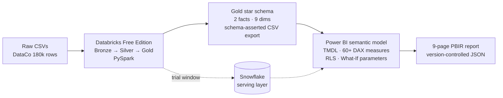

- **PySpark is the authoritative transform layer** — all cleaning pushed upstream out of Power Query; the M layer is a thin loader with a rigid schema contract (`data-pipeline/01_gold_build.py` asserts types post-write).
- **Snowflake** served the Gold layer during its trial window; the **CSV export is the durable fallback** with an identical schema contract, so the repo stays reproducible forever.
- **Everything that defines the model and report is text** (TMDL for the model, PBIR JSON for visuals) and lives in Git — the `.pbix` binary is a build artifact, downloadable from [Releases](../../releases).

---

## The commercial measure stack (v2 core)

```
Net Sales
  − Total Cost-to-Serve        ← Handling (ABC: $2.50/order + $0.50/unit)
                                  + Freight (per-mode rate × (1 + Freight Surcharge %))
                                  + MOQ Penalty ($25 × sub-threshold orders)
  = Net Commercial Margin
  − Estimated SLA Penalty       ← 3% × Revenue at Risk (late-flagged orders)
  − Retailer Rebate Accrual     ← tiered 1/3/5% by net-sales volume (+ Rebate Shift %)
  = True Net Profit (Post-Rebate)
```

The three What-If sliders feed the underlined inputs, so dragging Freight Surcharge to 25% moves CTS, Net Commercial Margin, and True Net Profit live across every page. Full definitions: report page 09 and [`docs/02_kpi_glossary.md`](docs/02_kpi_glossary.md).

---

## The 9 pages (v2)

> v1 baseline captures for every page: [`powerbi/screenshots/v1/`](powerbi/screenshots/v1/)

**01 — Executive Overview** — top-line KPIs, True Net Profit, CTS target line, What-If sliders
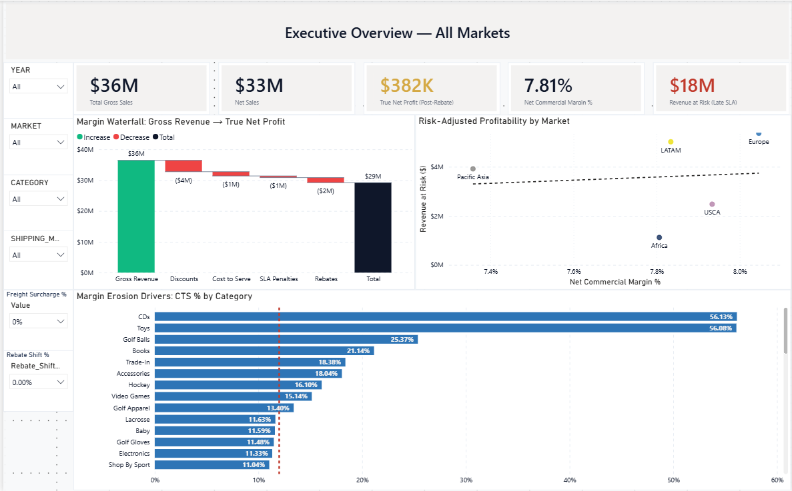

**02 — Revenue & Margin** — Gross vs Net Commercial Margin, swappable dimension axis, KPI strip
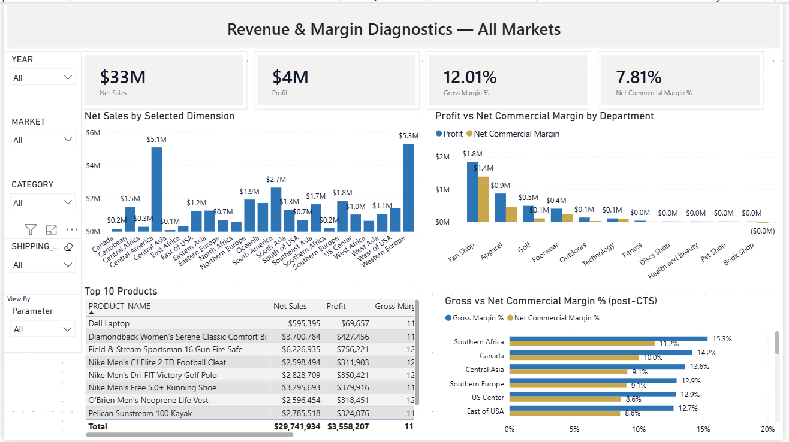

**03 — Profitability Diagnostic** — Net Sales vs post-CTS margin scatter, break-even line, CTS composition
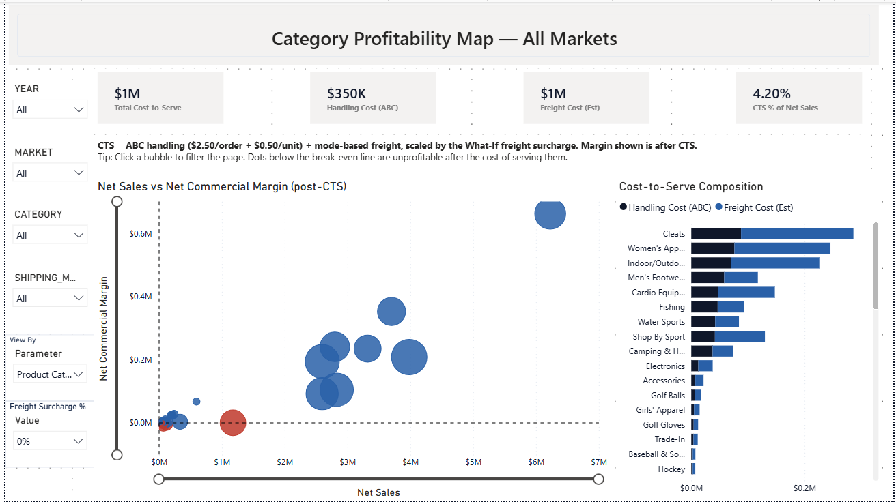

**04 — Pricing & Discount Impact** — discount efficiency scatter, margin erosion by band, profit capture
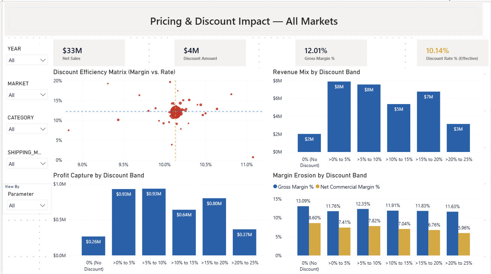

**05 — Discount Leakage** — Top-20 leakage table with rebate accrual, trade-spend trend, market bars
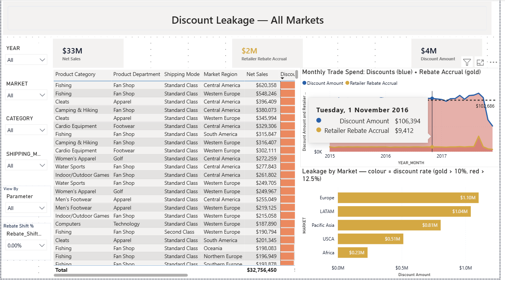

**06 — Operations Overview** — late-rate trend vs best-mode target, Revenue at Risk by market, SLA penalty
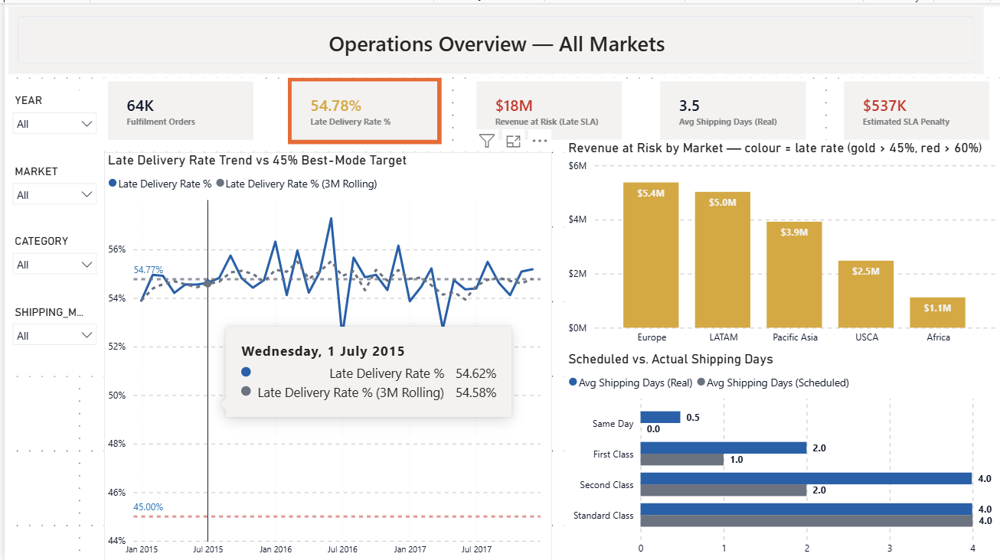

**07 — Operations Deep Dive** — market pivot with freight + penalty columns, delay drivers, MOQ lever
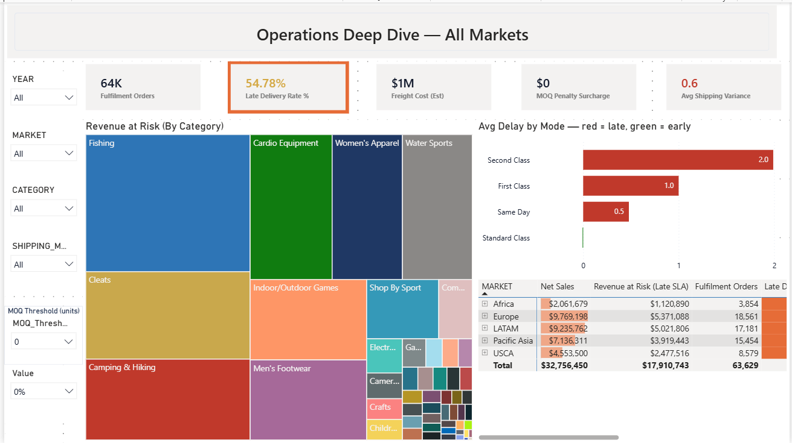

**08 — Customer Retention** — cohort retention heat map, segment alerts, New vs Returning mix
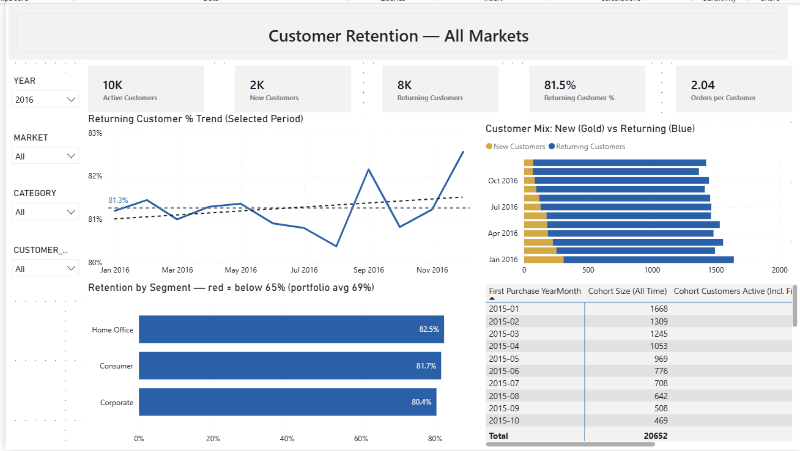

**09 — Data Trust & KPI Definitions** — pass/fail governance indicators, QA evidence, measure glossary
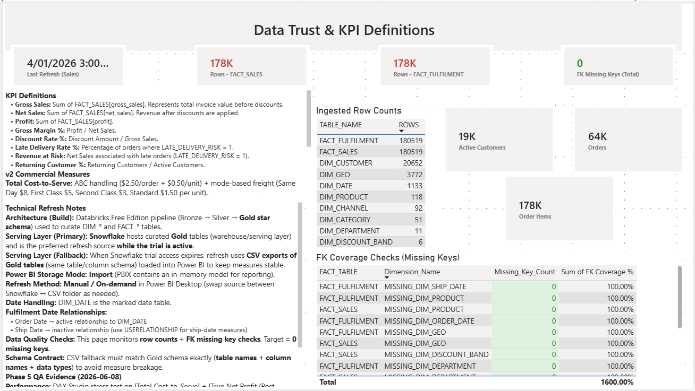

---

## Engineering practices

- **Version-controlled BI**: PBIP project format — semantic model as TMDL, report as PBIR JSON. Branch-per-version (`main` = v1 baseline, `feature/v2-commercial-upgrade` = the full v2 history), one commit per upgrade batch, Desktop-verified between batches.
- **Captured-pattern workflow**: Power BI's report JSON has undocumented serialization shapes (field-parameter bindings, reference lines, conditional `FillRule` gradients). Rather than guessing, working shapes were captured from Desktop's own saves and reused as templates for all conditional-formatting and parameter wiring.
- **BPA hygiene**: all divisions use `DIVIDE()`, FK columns hidden, explicit format strings, display folders on all 60+ measures.
- **Performance**: DAX Studio stress test on the heaviest measures (`Total Cost-to-Serve`, `True Net Profit`) — **164 ms total** (FE 94 / SE 70), well under the 300 ms budget. v1 Performance Analyzer pass documented in [`docs/11_performance_test_optimization.md`](docs/11_performance_test_optimization.md).
- **Data trust as a feature**: page 09 turns red if row counts deviate from 180,519 or any FK check finds missing keys.
- **Row-Level Security**: market-level access via `SEC_USER_MARKET` → `DIM_MARKET` → `DIM_CHANNEL` propagation; zero-leakage verified with View-as (details: [`docs/10_rls.md`](docs/10_rls.md)).

---

## Star schema

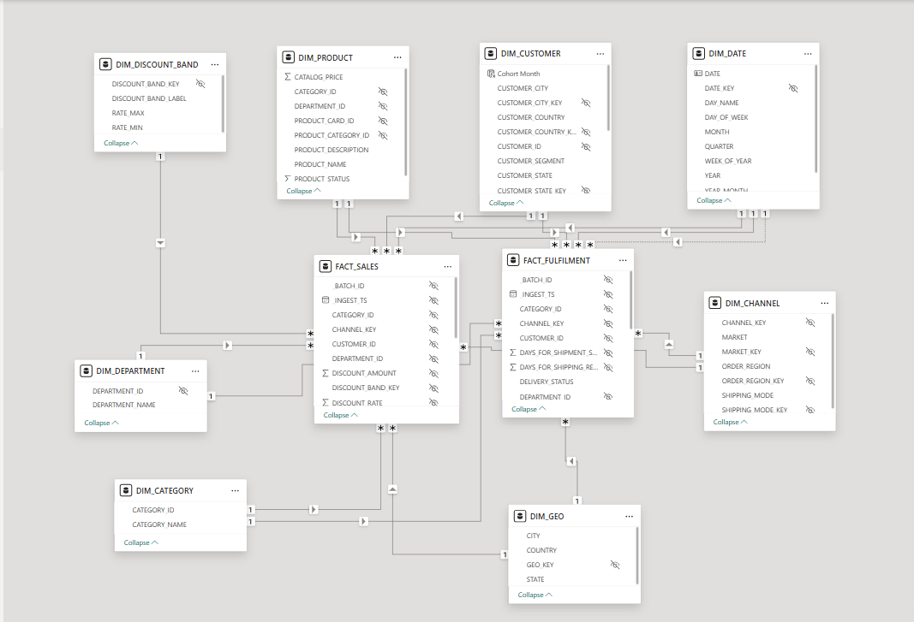

**Grain:** 1 row per order item in both facts.

- **Facts:** `FACT_SALES` (commercial outcomes), `FACT_FULFILMENT` (delivery outcomes, ship-date role via inactive relationship + `USERELATIONSHIP`)
- **Conformed dimensions:** `DIM_DATE`, `DIM_CUSTOMER`, `DIM_PRODUCT`, `DIM_CATEGORY`, `DIM_DEPARTMENT`, `DIM_GEO`, `DIM_CHANNEL`, `DIM_MARKET`, `DIM_DISCOUNT_BAND`
- Both facts join all shared dimensions, so one slicer filters commercial *and* fulfilment measures consistently.

Full contract: [`docs/08_star_schema.md`](docs/08_star_schema.md)

---

## Quick start

1. **Clone** the repo — the Gold CSV exports ship with it (`data/databricks_gold_export/`).
2. **Open** `powerbi/Commercial + Fulfilment Executive Dashboard.pbip` in Power BI Desktop.
3. If prompted for the data folder parameter, point `pDataFolder` to your local `data/databricks_gold_export/` path and refresh.
4. **Validate** on page 09 — all indicators should be green (180,519 rows, 0 missing keys).
5. **Play**: drag the Freight Surcharge slider on page 01 and watch True Net Profit react.

Prefer a single file? Download the **`.pbix` from [Releases](../../releases)**.

**Test RLS:** Modeling → View as → `MarketManager`, identity `europe_mgr@company.com` → everything restricts to Europe.

---

## Repo structure

```text
data-pipeline/           PySpark Gold curation (authoritative ETL)
data/
  databricks_gold_export/  Gold CSVs (the durable serving layer)
docs/                    Proof pack: BI brief, KPI glossary, star schema,
                         data quality reports, RLS design, performance notes
powerbi/
  *.pbip                 Power BI project entry point (open this)
  *.SemanticModel/       TMDL model source (tables, measures, roles)
  *.Report/              PBIR report source (pages, visuals as JSON)
  screenshots/v1/        v1 baseline captures
  screenshots/v2/        v2 release captures
sql/                     Legacy Snowflake/SQL Gold build (deprecated; PySpark is authoritative)
```

---

## Roadmap (v3 candidates)

- **Contract-true SLA penalties**: the data carries per-mode SLA targets and a 2%/day penalty rate — replace the flat 3% with day-accurate penalty accrual.
- **Deneb margin waterfall**: Gross Revenue → discounts → CTS → penalties → rebates → True Net Profit bridge chart (Vega-Lite).
- **Service deployment**: publish to Power BI Service with scheduled refresh once a work account is available.

---

*Documentation pack in [`docs/`](docs/) · Release history in [Releases](../../releases)*
