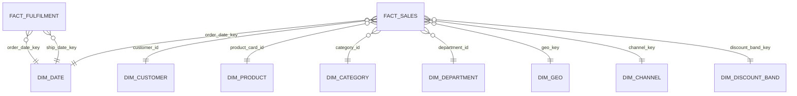

# Gold Data Quality Report

## Snapshot (Build Results)

## Star Schema (Gold)

### 1) Row Counts

| table_name             |   rows |
| ---------------------- | -----: |
| gold.dim_date          |   1133 |
| gold.dim_customer      |  20652 |
| gold.dim_product       |    118 |
| gold.dim_category      |     51 |
| gold.dim_department    |     11 |
| gold.dim_geo           |   3772 |
| gold.dim_channel       |     92 |
| gold.dim_discount_band |      6 |
| gold.fact_sales        | 180519 |
| gold.fact_fulfilment   | 180519 |

### 2) Dimension Key Uniqueness (rows must equal distinct keys)

All dimensions passed uniqueness checks:

- dim_date 1133/1133
- dim_customer 20652/20652
- dim_product 118/118
- dim_category 51/51
- dim_department 11/11
- dim_geo 3772/3772
- dim_channel 92/92
- dim_discount_band 6/6

### 3) Fact Grain Uniqueness (rows must equal distinct order_item_id)

- fact_sales: 180519 rows, 180519 distinct order_item_id
- fact_fulfilment: 180519 rows, 180519 distinct order_item_id

### 4) Null Checks (core keys)

fact_fulfilment null checks:

- order_item_id: 0
- order_id: 0
- customer_id: 0
- product_card_id: 0
- order_date_key: 0
- ship_date_key: 0

### 5) FK Coverage (Sales Fact)

All FK coverage checks returned 0 missing keys:

- order_date_dim, customer_dim, product_dim, geo_dim, channel_dim, discount_band_dim, category_dim, department_dim: **0**
- fact_rows: 180519

### 6) FK Coverage (Fulfilment Fact)

All FK coverage checks returned 0 missing keys:

- order_date_dim, ship_date_dim, customer_dim, product_dim, geo_dim, channel_dim, category_dim, department_dim: **0**
- fact_rows: 180519

## Sanity Checks

### Sales measures

- discount_rate range: 0 to 0.25
- min net_sales: 7.489999771
- min gross_sales: 9.989999771
- min profit: -4274.97998 (negative profit exists and is treated as a valid business scenario)

### Fulfilment measures

- shipping_days_variance range: -2 to 4
- **Late lines — two definitions (reconciled):**
  - `late_delivery_risk = 1`: **98,977 / 180,519 = 54.8%** — equals exactly the rows where `delivery_status = 'Late delivery'`. **This is the dashboard's `Late Delivery Rate %`.**
  - `is_late_by_days ≥ 1` (actual shipping days > scheduled): **103,400 / 180,519 = 57.3%** — a broader operational lateness signal.
  - Both are correct against their own definition; the dashboard standardises on the 54.8% flag. (The original v1 snapshot here reported only the 57.3% figure.)
- `delivery_status` distribution: Late delivery 98,977 · Advance shipping 41,592 · Shipping on time 32,196 · Shipping canceled 7,754.

## v2 Enrichment Validation (Stage 2)

The v2 commercial enrichment (`data-pipeline/02_gold_schema_remediation.py`) runs on the CSV export and self-reports a PASS / MOCKED diagnostic matrix every run. **PASS** = structural/integrity check passed on real data; **MOCKED** = column is benchmark-synthesized (DataCo has no such field — see [`03`](03_data_dictionary_notes.md) §6 and [`01`](01_bi_brief.md) §2A).

| Check | Result |
| :---- | :----- |
| Row count `fact_sales` / `fact_fulfilment` = 180,519 | **PASS** |
| PK uniqueness `order_item_id` (both facts) | **PASS** |
| FK coverage — all 12 FK paths, zero orphans | **PASS** |
| `dim_contract_terms` written (9 rows: Bronze/Silver/Gold × 3 segments) | **PASS** |
| Profitability sanity — `total_logistics_cost ≤ gross_sales` on every row | **PASS** (0 violations) |
| Chronological — `order_date ≤ expected_delivery_date` | **PASS** |
| Ship-date orphan check | **PASS** |
| Discount sanity — `discount_amount ≤ gross_sales` | **PASS** |
| Waterfall bridge — `gross_revenue − discount_amount = net_sales` | **PASS** |
| CTS/ABC drivers, freight/SLA/rebate rates, dates, `is_promotional`, contract tiers | **MOCKED** (benchmark) |

> Honesty note: the MOCKED rows are the cost/SLA/rebate **rates and physical attributes**, deterministically generated to industry benchmarks. Every structural and integrity check runs on the **real** 180,519-row fact data and passes. The seed is fixed (42) so re-runs are reproducible.

## Conclusion

Gold schema is structurally valid:

- No row loss vs Silver (180,519 in both facts)
- Grain enforced (1 row per `order_item_id`)
- Dimensions unique; 100% FK coverage
- v2 enrichment integrity checks all PASS; synthesized columns clearly labelled

Gold is ready for the CSV export serving layer (and was loaded to Snowflake during the trial) and modelling in Power BI.
